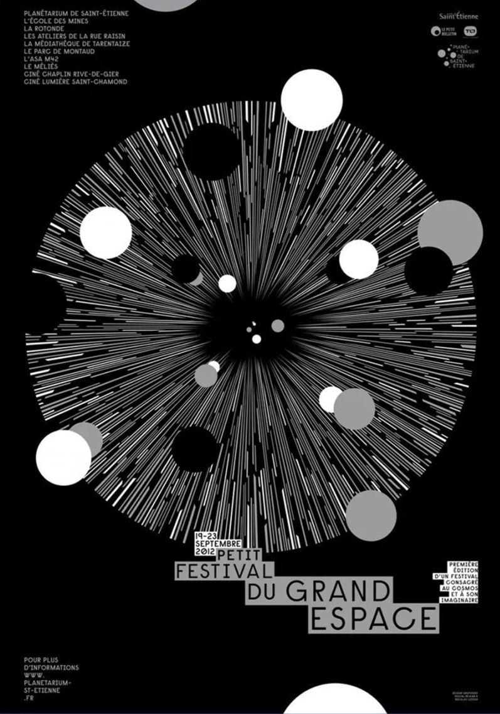
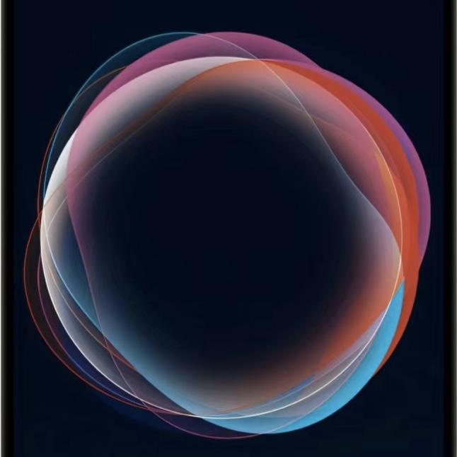

# Coding report
**Jelly Wu  |  Unikey:jiwu0118**

My work is named **Destiny in the Universe**. The animation starts automatically, and each wheel creates a waving effect, as well as the entrance to the black hole waving as well.

### Details of animated coding
- **Animation Methods: Perlin noise**
  
- **Animated Properties**

  The shape of the wheel's ring and the overall size and position of the wheel are animated. In addition, I also added backgrounds to enrich the theme of the artwork.
  I used random seed to keep the wheel uniform across the whole. And used perlin noise to generate offsets and a dynamic outmost ring.

- **Inspiration**

[*Inspiration 01*](https://www.pinterest.com.au/pin/314196511489863739/)

Inspiration 01: This image inspired the theme of my artwork, it gives me the feeling of a universal black hole. The irregular circular background can be realized by my animation theme: perlin noise, and the different sizes of the circles also create a sense of perspective in the image.

[*Inspiration 02*](http://xhslink.com/f6RdQK)

Inspiration 02: Both this image and siri inspired me to change circle base, which floats around the edges and different colors are overlaid to create different effects. So I changed the edges of the wheel based on this inspiration

- **Technical explanation** 
  
  1. Add getNoisyPosition() to make the overall position of the wheel wave. [Refer to week 10 tut](https://canvas.sydney.edu.au/courses/56592/pages/week-10-tutorial-2?module_item_id=2309124)
  2. In the outer ring part of the wheel, I use vertex instead of ellipse in the base code of the group to make the outer ring of each wheel wave. It combines with the wave of the overall position of the wheel (point 1), like some floating things out of gravity in the universe.
  3. Add circles made up of lines in the background, and add offsets to the lines to draw the entrance to a black hole that looks like it's sucking things in.
  4. Resize the wheel: make the size of the wheel scale according to the distance from the center of the canvas, the closer to the center of the canvas the smaller the wheel. Create a sense of space hierarchy.

  

